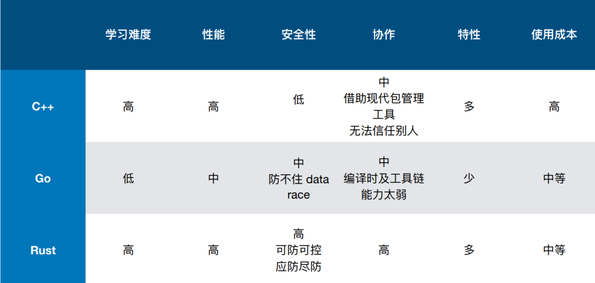

# 基于riscv使用rust开发的os内核

本项目建立初衷是通过使用当下新兴的安全语言**Rust**设计一个基于**riscv**的操作系统内核，完成从理论到实践的转变。全流程设计**os**的尝试，为日后的进一步探索打下基础。

## 一、为什么要用rust进行设计

首先，从**Rust**这门语言本身来看，**Rust**已经连续七年位居**Stack Overflow**最受开发者喜爱的编程语言榜榜首。

此外，**Rust**兼具不逊于**C**的性能与其不具有的安全性。

当今时代，对语言安全性的要求愈发严苛。例如，美国国防部高级研究计划局（DARPA）正在推动程序代码转换工具**TRACTOR**的开发。**TRACTOR**是 TRanslating All C TO Rust 的缩写，该项目旨在开发机器学习工具，自动将旧**C**代码转换为**Rust**代码，并且在操作系统方面**Linux**也推出了 Rust For Linux 项目， 包括微软也正在用**Rust**编程语言重写核心**Windows**库。。

从另一方面来讲，操作系统可以说是生存周期最长的软件，但操作系统的前期规划与设计具有很大的偶然性、历史局限性和开发者的个人主观特征。1991年发布的**Linux**的软件设计思路来源于1969年的**UNIX**，而它们在最开始都是由一位天才的软件开发程序员来完成的。贝尔实验室的两位软件工程师 Ken Thompson 与 Dennis Ritchie经历多次迭代开发，用汇编语言写**UNIX**，再尝试用**B**语言写**UNIX**，最后发明**C**语言重写**UNIX**。整个操作系统的核心代码量在一万行以下。而Dennis Ritchie设计**C**语言就是为了方便开发**UNIX**操作系统，所以编程简洁灵活，方便访问硬件，以及良好的可移植性成为**C**语言的首要设计目标。**C**语言就是为写**UNIX**而诞生的。Dennis Ritchie和KenThompson没有期望设计一种新语言能帮助高效简洁地开发复杂的应用业务逻辑，只是希望用一种简洁的方式抽象出计算机的行为，便于编写控制计算机硬件的操作系统，最终的结果就是**C**语言。

但是，我们从学习**C**语言开始，就被指针支配，它在提供灵活性的同时带来最常见的报错。而且**C**语言缺少有效的并发支持，导致内存和并发漏洞成为当前操作系统的噩梦。直到**Rust**语言的出现。**Rust**语言具有与**C**一样的硬件控制能力，且大大强化了安全编程。从某种角度上看，新出现的**Rust**语言的核心目标是解决**C**的短板，取代**C**。所以用**Rust**写**OS**具有很好的开发和运行的体验。

而用**Rust**写**OS**的代价仅仅是学会用**Rust**编程。

从国内高校教学来看，清华率先开设**rcore**课程，并开设了一些关于**Rust**语言的选修课，国内其它高校包括国防科大、华中科大等紧随其后开设相关课程，国内**Rust**的开源生态建设也越来越好，开放原子基金会最近也举办了基于**Rust**语言的算法竞赛活动。

虽然学习曲线陡峭这一点为人诟病，但是只要掌握了生命周期和所有权的概念，其它的就水到渠成了。

## 二、为什么基于riscv

最常见的的**CPU**是**x86**和**ARM**，他们已经广泛应用在服务器，台式机，移动终端和很多嵌入式系统中。它们需要支持非常多的软件系统和应用需求，导致它们越来越复杂。**x86**的向过去兼容的策略确保了它的江湖地位，但导致其丢不掉很多已经比较过时的硬件设计，让操作系统疲于适配这些硬件特征。**x86**和**ARM**都很成功，这主要是在商业上，其广泛使用是的其**CPU**硬件逻辑越来越复杂，且不够开放，不能改变，不是开源的，提高了操作系统开发者的学习难度。从某种角度上看，新出现的**RISC-V**的核心目标是灵活适应未来的**IoT**场景，保证基本功能，提供可配置的扩展功能。其开源特征使得学生都可以方便地设计一个**RISC-V**的**CPU**，例如我们本次使用**chisel**设计的**cpu**。

写面向**RISC-V**的**OS**的代价仅仅是你了解**RISC-V**的**Supevisor**特权模式，知道**OS**在**Supevisor**特权模式下的控制能力。

## 三、整体框架

### 源码结构

	easy-fs 
    │
    os
    ├── Cargo.lock
    ├── Cargo.toml
    ├── Makefile
    ├── build.rs
    ├── src
    │   ├── boards
    │   ├── config.rs
    │   ├── console.rs
    │   ├── drivers
    │   ├── entry.asm
    │   ├── fs
    │   ├── lang_items.rs
    │   ├── link_app.S
    │   ├── linker.ld
    │   ├── logging.rs
    │   ├── main.rs
    │   ├── mm
    │   ├── sbi.rs
    │   ├── sync
    │   ├── syscall
    │   ├── task
    │   ├── timer.rs
    │   └── trap
    ├──target
    │   ├── CACHEDIR.TAG
    │   ├── debug
    │   ├── release
    │   └── riscv64gc-unknown-none-elf
    user
    ├── Cargo.lock
    ├── Cargo.toml
    ├── Makefile
    ├── README.md
    ├── build
    │   ├── app
    │   ├── asm
    │   ├── bin
    │   └── elf
    ├── build.py
    ├── rust-toolchain.toml
    ├── src
    │   ├── bin
    │   ├── console.rs
    │   ├── lang_items.rs
    │   ├── lib.rs
    │   ├── linker.ld
    │   └── syscall.rs
    └── target
        ├── CACHEDIR.TAG
        ├── release
        └── riscv64gc-unknown-none-elf

### 框架

### 目前实现

现在已经实现了**OS**的基本内核功能，部分系统调用，由于时间有限，现在项目还在飞速开发中。

**特点**：

+ 基于组件化设计实现
+ 安全性好

## 四、未来发展方向

在基于组件化设计和实现操作系统的基础上，进一步完善系统调用，并且向**hypervisor**虚拟化方向探索。

## 参考资料

《rCore Tutorial Book v3》
《Riscv手册》
《Operating Systems: Three Easy Pieces》
《rCore-Camp-Guide-2024A》
《深入理解计算机系统》

## 开源地址

本项目的代码已开源，项目地址：[https://github.com/wingrew/bitos](https://github.com/wingrew/bitos)
